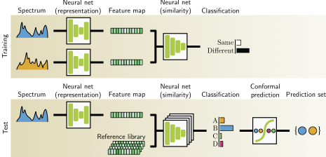

### Contrastive spectra matching 
This repository provides the implementation for our paper [Raman spectra matching with contrastive representation learning](https://arxiv.org/abs/2202.12549). We experimentally show that we significantly outperform or is on par with the existing approaches for Raman spectra identification on three publically available datasets. 



#### Requirement 
```bash
git clone https://github.com/lyn1874/raman_spectra_matching_with_contrastive_learning.git
cd contrastive_spectra_matching
conda env create -f spectra_matching.yaml
conda activate torch_dl
```

#### Testing
The top-1 matching process and conformal prediction process per dataset is shown in the jupyter file `test_experiment.ipynb`

#### Training
To train a spectra matching model for each dataset, run the following script:
```bash
./run_rruff.sh raw '0 1 2 3'
./run_rruff.sh excellent_unoriented '0 1 2 3'
./run_organic.sh raw '0 1 2 3'
./run_organic.sh preprocess '0 1 2 3'
./run_bacteria.sh bacteria_random_reference_finetune '0 1 2 3'
```
The `repeat_g` in each script represents the number of models that are used for the ensemble calculation

#### Reproduce figures

```python
python paper_figures.py --index figure_augmentation_example --save False --pdf_pgf pdf
```

#### Dataset

You can download the Mineral and Organic dataset here: https://data.dtu.dk/articles/dataset/Datasets_for_replicating_the_paper_Raman_Spectrum_Matching_with_Contrastive_Representation_Learning_/20222331 As for the Bacteria dataset, you can visit the official repository https://github.com/csho33/bacteria-ID for downloading the dataset.  

#### Experiments

You can download the experiments for each of the datasets here: https://data.dtu.dk/articles/dataset/Experiments_for_replicating_the_paper_Raman_spectrum_matching_with_contrastive_representation_learning_/21590934 

#### Citation
If you use this code, please cite:
```
@Article{D2AN00403H,
author ="Li, Bo and Schmidt, Mikkel N. and Alstrøm, Tommy S.",
title  ="Raman spectrum matching with contrastive representation learning",
journal  ="Analyst",
year  ="2022",
volume  ="147",
issue  ="10",
pages  ="2238-2246",
publisher  ="The Royal Society of Chemistry",
doi  ="10.1039/D2AN00403H",
url  ="http://dx.doi.org/10.1039/D2AN00403H",
}
```

